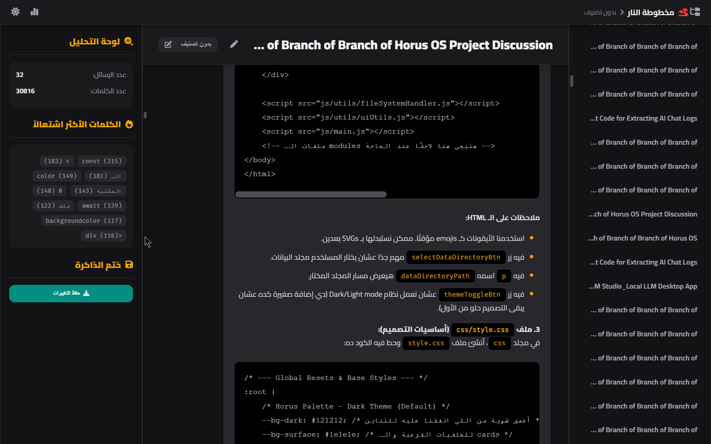

  <h1>Codex Ignis 📜 مخطوطة النار</h1>
    
  
<strong>حيثُ لا تُنسى المعرفة، وتُحفظ أصداء الحكمة في لهيب الأرشيف.</strong>

  

    <a href="https://seif4d.github.io/Codex-Ignis/"><strong>🚀 جرب الصفحة الرئيسية</strong></a>
       |   
    <a href="https://seif4d.github.io/Codex-Ignis/app.html"><strong>🔥 افتح التطبيق مباشرة</strong></a>
  

  

    
    
    
    
  

> **Codex Ignis** هو ليس مجرد عارض ملفات، بل هو نظام أرشفة ذكي ومتكامل لإدارة المعرفة الشخصية المستخرجة من محادثات الذكاء الاصطناعي. استدعِ، استكشف، وحلل أرشيف محادثاتك في واجهة واحدة، قوية، وساحرة تعمل بالكامل في متصفحك.

---

## 🐉 قوة التنين بين يديك: المميزات الرئيسية

*   ✨ **استدعاء شامل:** قم باستيراد محادثاتك بسهولة من **ChatGPT**، **DeepSeek**، وملفات **AI Studio** مباشرةً. كل ذكرياتك في مكان واحد.
*   🧠 **تنظيم ذكي:** صنّف محادثاتك، رتبها أبجديًا أو حسب الحجم والتاريخ، وابحث في العناوين والمحتوى للعثور على أي معلومة في ثوانٍ.
*   ✏️ **تحكم كامل:** عدّل عناوين المحادثات وتصنيفاتها بسهولة. أرشيفك يتشكل حسب رؤيتك، لتصنع مكتبتك المعرفية الخاصة.
*   📊 **رؤى تحليلية:** اكتشف "الكلمات الأكثر اشتعالاً" في محادثاتك واحصائيات مفيدة لفهم أعمق لأفكارك وتفاعلاتك.
*   🚀 **يعمل بالكامل في المتصفح:** لا حاجة للتثبيت أو رفع ملفاتك لأي خادم. كل شيء يحدث محلياً على جهازك.
*   🔒 **الخصوصية أولاً:** ملفاتك تبقى ملكك. لا يتم إرسال أي بيانات لأي مكان. أنت تمتلك أرشيفك بالكامل.
*   🎨 **تصميم ساحر:** واجهة مستخدم جميلة مستوحاة من "النار والظل"، مع وضع ليلي ونهاري وتجربة استخدام سلسة.

---

## 🚀 البدء والاستخدام (في أقل من دقيقة)

استخدام **Codex Ignis** بسيط للغاية:

1.  **افتح التطبيق:** اذهب مباشرة إلى [**صفحة التطبيق**](https://seif4d.github.io/Codex-Ignis/app.html) التي تعمل عبر GitHub Pages.
2.  **(اختياري) احتفظ بنسخة:** يمكنك تحميل ملف `app.html` بالضغط على `Ctrl + S` للاحتفاظ بنسخة تعمل بدون انترنت على جهازك.
3.  **استدعِ الذكريات:** من داخل التطبيق، اضغط على زر "ملف" أو "مجلد" لتحميل محادثاتك.
4.  **أطلق العنان للاستكشاف!** تصفح، ابحث، حلل، وعدّل أرشيفك.

---

## 📜 الصيغ المدعومة حالياً

التطبيق مصمم للتعرف تلقائيًا على بنية الملفات من المصادر التالية:

-   ملف `conversations.json` من **ChatGPT**.
-   ملف `chat_log.json` من **DeepSeek**.
-   مجلد يحتوي على ملفات JSON من **Google AI Studio**.
-   ملف `Codex_Ignis_Export.json` الذي تم تصديره من التطبيق نفسه.

---

## 🛠️ التقنيات المستخدمة

هذا المشروع هو دليل على قوة تقنيات الويب الحديثة، وهو مبني باستخدام:

-   **HTML5**
-   **CSS3** (مع استخدام متغيرات CSS لتصميم مرن)
-   **JavaScript (Vanilla)**: لا توجد مكتبات أو أطر عمل ضخمة!
-   **Marked.js:** لتحويل Markdown إلى HTML.
-   **DOMPurify:** لضمان الأمان عند عرض محتوى HTML.

---

## 🤝 للمساهمة

أهلاً بك يا رفيق الدرب في رحلة تطوير هذه المخطوطة! المساهمات مرحب بها جداً. سواء كانت لديك فكرة لميزة جديدة، أو وجدت خطأً، أو ترغب في تحسين الكود:

1.  قم بعمل **Fork** للمستودع.
2.  أنشئ فرعاً جديداً لميزتك (`git checkout -b feature/AmazingFeature`).
3.  قم بعمل **Commit** لتغييراتك (`git commit -m 'Add some AmazingFeature'`).
4.  قم بعمل **Push** للفرع (`git push origin feature/AmazingFeature`).
5.  افتح **Pull Request**.

يمكنك أيضاً فتح **Issue** لمناقشة فكرة أو الإبلاغ عن مشكلة.

---

## ⚖️ الترخيص

هذا المشروع مرخص تحت رخصة MIT. انظر ملف `LICENSE` لمزيد من التفاصيل.
